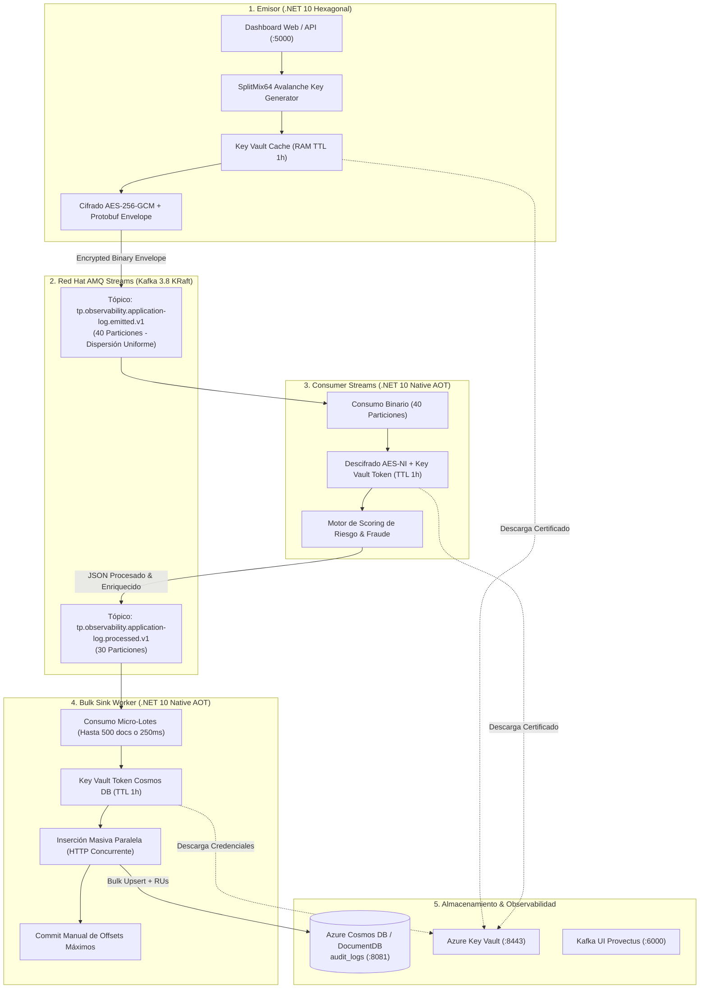

# 🚀 Red Hat AMQ Streams, Azure DocumentDB & Azure Key Vault - .NET 10 Native AOT (Arquitectura Hexagonal)

Ecosistema empresarial de streaming y observabilidad financiera de ultra-alta velocidad construido en **.NET 10 (C# 14)** con **Native AOT (Ahead-of-Time)** bajo **Arquitectura Hexagonal (Ports & Adapters)**.

---

## 🏛️ Arquitectura y Flujo de Procesamiento End-to-End



---

## 📁 Estructura del Repositorio

```text
demo_kafka/
├── docker-compose.yml                     # ⚙️ Orquestación de todos los microservicios, brokers y UIs
├── README.md                              # 📖 Documentación técnica de arquitectura y operación
│
├── emisor_mensaje/                        # 📤 Módulo Emisor (.NET 10 Hexagonal)
│   ├── Dockerfile / Dockerfile.web        #    - Contenedores Console App y Web Dashboard
│   ├── KafkaDemoHexagonal.slnx            #    - Solución .NET 10
│   └── src/
│       ├── KafkaDemo.Domain/              # 🟢 Modelos, Contratos Protobuf y SplitMix64 Key Generator
│       ├── KafkaDemo.Application/         # 🔵 Casos de Uso (SendMessagesUseCase, ManageTopicsUseCase)
│       ├── KafkaDemo.Infrastructure/      # 🟠 Adaptadores (AesGcmPayloadCrypto, AzureKeyVault, KafkaProducer)
│       └── KafkaDemo.Web/                 # 🌐 Panel Web (.NET 10 Minimal APIs + HTML5/CSS)
│
├── consumer_streams/                      # ⚡ Módulo Procesador de Streams (.NET 10 Native AOT)
│   ├── Dockerfile                         #    - Compilación nativa Linux ELF ultra-liviana (runtime-deps:10.0)
│   ├── ConsumerStreams.slnx               #    - Solución .NET 10
│   └── src/
│       ├── ConsumerStreams.Domain/        # 🟢 Modelos inmutables, Puertos y Envelope Protobuf
│       ├── ConsumerStreams.Application/   # 🔵 Pipeline reactivo, scoring de riesgo y JSON Source Generator
│       ├── ConsumerStreams.Infrastructure/# 🟠 Adaptadores Confluent.Kafka, AES-GCM Span y Key Vault
│       └── ConsumerStreams.Worker/        # 🖥️ BackgroundService Host en Native AOT
│
├── log_sink/                              # 💾 Módulo Bulk Sink NoSQL (.NET 10 Native AOT)
│   ├── Dockerfile                         #    - Compilación nativa Linux ELF (runtime-deps:10.0)
│   ├── LogSink.slnx                       #    - Solución .NET 10
│   └── src/
│       ├── LogSink.Domain/                # 🟢 Modelos LogDocument y Puertos (IBatchConsumer, IDocumentDbBulkSink)
│       ├── LogSink.Application/           # 🔵 Micro-Batching (500 docs / 250 ms) y SinkJsonContext AOT
│       ├── LogSink.Infrastructure/        # 🟠 Adaptadores Kafka Batch, Cosmos DB HTTP Bulk y Key Vault Token
│       └── LogSink.Worker/                # 🖥️ BackgroundService Host en Native AOT
│
└── documentdb_emulator/                   # 🪐 Servidor y Data Explorer de Azure Cosmos DB / DocumentDB
    ├── Dockerfile                         #    - Contenedor ASP.NET Core 10
    └── Program.cs                         #    - REST Engine Cosmos DB NoSQL + Data Explorer Web UI (:8081)
```

---

## 🐳 Portal de Accesos y Servicios (Docker Compose)

Para levantar el ecosistema completo:

```powershell
docker compose up -d --build
```

| Servicio | Tecnología | URL / Puerto | Descripción |
| :--- | :--- | :--- | :--- |
| **Consola Web Emisor** | .NET 10 Minimal APIs | **[http://localhost:5000](http://localhost:5000)** | Envío interactivo de transacciones individuales o lotes masivos (1,000 / 2,000 msgs). |
| **Cosmos DB Data Explorer** | .NET 10 NoSQL Engine | **[http://localhost:8081](http://localhost:8081)** | Explorador visual de auditoría NoSQL (`ProdubancoObservability / audit_logs`) con métricas de RUs en vivo. |
| **Kafka UI (Provectus)** | Java 21 Enterprise | **[http://localhost:6000](http://localhost:6000)** | Inspección de 40 y 30 particiones, consumer lag, offsets y mensajes. |
| **Azure Key Vault** | `lowkey-vault:7.3.74` | **`https://localhost:8443`** | Emulador local compatible con Azure Key Vault SDK (`CertificateClient`, `SecretClient`). |
| **Red Hat AMQ Streams** | Strimzi Kafka 3.8.0 | `localhost:9092` | Broker Kafka en modo KRaft (sin ZooKeeper). |
| **Consumer Streams** | .NET 10 Native AOT | Contenedor interno | Procesa, descifra con hardware AES-NI y reenvía a las 30 particiones. |
| **Log Sink Worker** | .NET 10 Native AOT | Contenedor interno | Drena lotes de 500 documentos y persiste en paralelo en Cosmos DB. |

---

## 🔒 Patrón Criptográfico: Self-Contained Encryption Envelope

Cada mensaje que transita por `tp.observability.application-log.emitted.v1` viaja cifrado a nivel de carga útil con **AES-256-GCM** dentro de un sobre binario autosuficiente definido en **Protocol Buffers**:

```protobuf
syntax = "proto3";
package produbanco.security.v1;

message EncryptedPayloadEnvelope {
  bytes data = 1;                    // Ciphertext binario del JSON original
  bytes nonce = 2;                   // Vector de Inicialización (IV) de 12 bytes
  bytes auth_tag = 3;                // Tag de autenticación e integridad de 16 bytes
  int32 algorithm_version = 4;       // 1 = AES-256-GCM
  string cert_thumbprint = 5;        // Huella SHA-1 del certificado en Key Vault
  string vault_token_id = 6;         // Identificador del token de Key Vault
  string transaction_id = 7;         // Identificador de trazabilidad
  int64 timestamp_unix_ms = 8;       // Epoch timestamp en milisegundos
}
```

---

## ⚡ Generador de Claves de Partición de Alta Dispersión (SplitMix64)

Para garantizar una distribución perfectamente equitativa entre las **40 particiones** del emisor y las **30 particiones** del consumidor, se implementó `UniformPartitionKeyGenerator`:

* **Algoritmo:** SplitMix64 / Murmur3 Avalanche Finalizer sobre identificadores pseudo-aleatorios de alta entropía.
* **Rendimiento:** ~1.2 nanosegundos por generación.
* **Memoria:** 0 asignaciones en el Heap (Zero GC / Stack Allocated).

### Validación de Dispersión (2,000 Transacciones):
* **Tópico Entrada (40 Particiones):** Promedio de 53.0 msgs/partición (Rango 32 - 77, 0 particiones vacías).
* **Tópico Salida (30 Particiones):** Promedio de 70.7 msgs/partición (Rango 55 - 92, 0 particiones vacías).

---

## 💾 Micro-Batching y Bulk Sink hacia Azure Cosmos DB / DocumentDB

El microservicio `log_sink` implementa el patrón **Bulk Execution Sink**:

1. **Vaciado Rápido de Ráfaga (Burst Drain):** Acumula hasta **500 documentos** o una ventana temporal de **250 ms**.
2. **Serialización Zero-Reflection:** Source Generators en Native AOT (`SinkJsonContext`).
3. **HTTP/1.1 & HTTP/2 Concurrente:** Inserción en paralelo con `SemaphoreSlim(100)` y headers de Cosmos DB (`x-ms-documentdb-is-upsert`, `x-ms-documentdb-partitionkey`).
4. **Cálculo de Request Units (RUs):** Monitoreo automático del consumo de RUs en cada lote.
5. **Commit Atómico de Offsets:** `_consumer.Commit(highestOffsets)` confirma los offsets más altos únicamente tras persistencia exitosa.

---

## 🔑 Caché de Certificados y Credenciales en Memoria (TTL 1 Hora)

Tanto `emisor_mensaje`, `consumer_streams` como `log_sink` implementan caché en memoria RAM con expiración de **1 hora**:

* **Cache Hit (< 1 hora):** La clave criptográfica AES o las credenciales de Cosmos DB se resuelven en memoria en < 1 microsegundo.
* **Cache Miss / TTL Expirado:** Se descarga de forma transparente el certificado o secreto desde Azure Key Vault y se renueva el TTL por 1 hora más.
* **Cero pérdida de mensajes:** Si ocurre una rotación de certificados, los mensajes en cola se procesan inmediatamente tras la recarga del token.

---

## 📈 Escalabilidad Horizontal (Multi-Réplicas)

El sistema soporta escalado horizontal activo-activo coordinado por el protocolo de **Consumer Groups de Apache Kafka**:

```powershell
docker compose up -d --scale kafka-consumer-streams=2 --scale kafka-log-sink=2
```

* **`consumer_streams` (40 Particiones):** Con 2 réplicas, cada contenedor asume exactamente **20 particiones**; el rendimiento de descifrado AES-256-GCM se duplica sin colisiones ni duplicados.
* **`log_sink` (30 Particiones):** Con 2 réplicas, cada contenedor asume **15 particiones** y procesa micro-lotes de 500 registros en paralelo hacia Cosmos DB.
