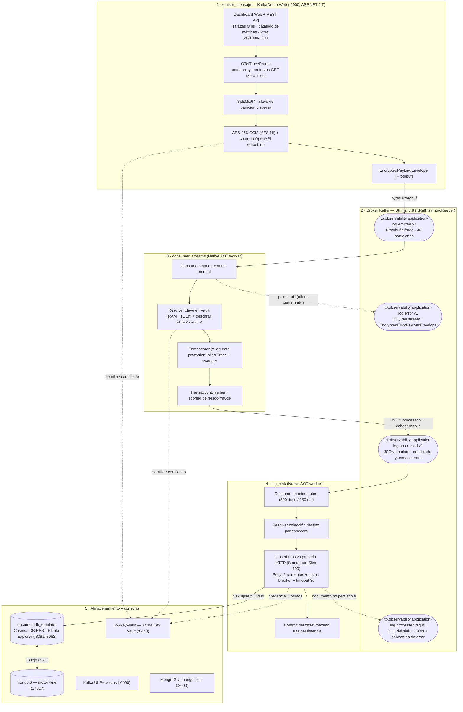

# 🚀 Pipeline de Observabilidad Financiera sobre Kafka — .NET 10 (C# 14) · Arquitectura Hexagonal · Native AOT

Demo local **end-to-end** de un pipeline de observabilidad para Produbanco. La telemetría de
**OpenTelemetry** (trazas, métricas y logs) se emite, se **cifra a nivel de carga útil**, se
transmite por **Kafka**, se **enmascara** según el contrato **OpenAPI** del servicio que la
originó, se **puntúa por riesgo/fraude** y se **persiste de forma masiva** en un emulador de
**Azure Cosmos DB / DocumentDB**.

Son **cuatro servicios .NET 10 independientes**, cada uno con su propia solución hexagonal
(Ports & Adapters). Los dos *workers* de streaming compilan a **binarios Native AOT** para
Linux. **Todo el texto, los comentarios y los logs están en español.**

> Es un entorno de **demostración**: la clave criptográfica es una semilla determinista
> compartida, el "Cosmos DB" es un *shim* REST mínimo y el factor de replicación de Kafka es 1.
> Nada de esto es apto para producción tal cual.

---

## 📋 Tabla de contenidos

1. [Contexto y objetivo](#-contexto-y-objetivo)
2. [Arquitectura y flujo de datos](#-arquitectura-y-flujo-de-datos)
3. [Los servicios, uno por uno](#-los-servicios-uno-por-uno)
4. [Los tópicos de Kafka, uno por uno](#-los-tópicos-de-kafka-uno-por-uno)
5. [El sobre criptográfico (Protobuf + AES-256-GCM)](#-el-sobre-criptográfico-protobuf--aes-256-gcm)
6. [Enmascarado por contrato OpenAPI](#-enmascarado-por-contrato-openapi-x-log-data-protection)
7. [Claves de partición de alta dispersión (SplitMix64)](#-claves-de-partición-de-alta-dispersión-splitmix64)
8. [Micro-batching, resiliencia y DLQ del sink](#-micro-batching-resiliencia-y-dlq-del-sink)
9. [Caché de material criptográfico (TTL 1 hora)](#-caché-de-material-criptográfico-ttl-1-hora)
10. [Escalabilidad horizontal](#-escalabilidad-horizontal-activo-activo)
11. [Estructura del repositorio](#-estructura-del-repositorio)
12. [Puertos y servicios (docker-compose)](#-puertos-y-servicios-docker-compose)
13. [Compilación, ejecución y pruebas](#-compilación-ejecución-y-pruebas)
14. [Estándares de gobierno](#-estándares-de-gobierno)

---

## 🎯 Contexto y objetivo

El propósito es mostrar, sobre infraestructura 100 % local, cómo se puede construir un canal de
observabilidad que sea **seguro por diseño**:

| Preocupación | Cómo se resuelve en la demo |
| :--- | :--- |
| **Confidencialidad en tránsito** | El JSON de telemetría se cifra con **AES-256-GCM** *antes* de tocar Kafka y viaja dentro de un sobre binario Protobuf autosuficiente. El broker nunca ve texto en claro. |
| **Minimización de datos sensibles** | `consumer_streams` enmascara el payload según las reglas `x-log-data-protection` declaradas en el **contrato OpenAPI** del servicio de origen (hash, últimos 4, borrado, ofuscado total), incluidos parámetros de ruta y query. |
| **Trazabilidad** | `transaction_id` / `trace_id` se propagan en el sobre y en cabeceras Kafka a lo largo de todo el recorrido. |
| **Resiliencia** | Consumo con *commit* manual de offsets, *poison-pill handling*, reintentos + *circuit breaker* (Polly) contra Cosmos DB y **DLQ dedicada** en cada etapa. |
| **Rendimiento** | *Workers* en **Native AOT** (arranque en milisegundos, sin JIT), enmascarado y podado de JSON con **cero asignaciones en el heap** (`Utf8JsonReader`/`Writer`), cifrado acelerado por hardware **AES-NI**. |
| **Gobierno** | Nombres de tópicos, variables de entorno e imágenes siguen los lineamientos de `data_guia/*.md`. |

El caso de negocio simulado es el microservicio **`Transfer.Mspx.Prometeus.Management`**
(gestión de transferencias): el emisor genera trazas y métricas OTel de sus endpoints y el
pipeline las audita y las archiva.

---

## 🏛️ Arquitectura y flujo de datos



**Recorrido feliz de un mensaje:**

1. El dashboard construye una traza/métrica OTel y la envía a `POST /api/messages/send` (o un lote a `/api/messages/send-batch`).
2. El emisor poda los arrays de respuesta si es una traza `GET`, genera la clave de partición, cifra el JSON con AES-256-GCM, adjunta el contrato OpenAPI en YAML y lo empaqueta en un `EncryptedPayloadEnvelope` Protobuf.
3. Publica los bytes en **`…emitted.v1`**.
4. `consumer_streams` lo consume, valida los campos obligatorios del sobre, resuelve la clave AES en el Vault (caché RAM), descifra y **enmascara** el JSON (si es `Trace` y trae contrato); calcula un *score* de riesgo que no altera el cuerpo.
5. Reenvía el **JSON descifrado y enmascarado** a **`…processed.v1`**; el *scoring* y el enrutado viajan en cabeceras (`x-service-name`, `x-telemetry-type`, `x-target-collection`, `x-risk-level`, `x-processed-status`, `x-latency-ms`, …).
6. `log_sink` acumula hasta 500 documentos (o 250 ms), resuelve la colección destino desde las cabeceras y hace *upsert* masivo en paralelo contra el emulador de Cosmos DB.
7. Confirma en Kafka únicamente los offsets ya persistidos.

---

## 🧩 Los servicios, uno por uno

### 1 · `emisor_mensaje` — Productor y consola de gestión

- **Proyecto activo:** `KafkaDemo.Web` (ASP.NET Core 10 Minimal APIs + dashboard HTML/CSS/JS, **JIT**, no AOT). Puerto **5000**.
- **Qué hace:**
  - **Genera telemetría OTel** de ejemplo: 4 trazas (`GET` + 3 `POST`) y un catálogo de tipos de métricas discretas, seleccionables desde el dashboard, más lotes sintéticos de transacciones (20 / 1 000 / 2 000).
  - **`OTelTracePruner`** — para trazas `GET`, trunca los arrays dentro de `http.response.body_preview` hasta `MaxArrayItems` / `MaxDepth` en un solo pase de streaming y **cero asignaciones**. Configurable (`TracePruning:*`).
  - **Cifra** el payload con **AES-256-GCM** (AES-NI) usando `transaction_id` como *Associated Data*, y lo envuelve en `EncryptedPayloadEnvelope` (Protobuf) con el **contrato OpenAPI YAML embebido** (`data_guia/transfer-mspx-prometeus.management.standard.yaml`).
  - **Detecta o asigna** el `telemetry_type` (Trace/Metric/Log) y valida que **todos los campos del sobre salvo `swagger`** estén presentes antes de publicar.
  - **Administra tópicos** vía `AdminClient`: listar, crear, borrar, detalle y *health* del clúster. Al enviar el **primer lote**, crea `…emitted.v1` con **40 particiones** si no existe.
- **REST API:** `/api/health`, `/api/topics` (GET/POST/DELETE), `/api/topics/{n}`, `/api/messages/send`, `/api/messages/send-batch`, `/api/traces/otel-get`, `/api/contracts/swagger`.
- **Solución:** `emisor_mensaje/KafkaDemoHexagonal.slnx` — `KafkaDemo.Domain` / `.Application` / `.Infrastructure` / `.Web` (+ `.ConsoleApp`, presente en la `.slnx` y con su `Dockerfile`, pero **desactivado** en `docker-compose`).

### 2 · `consumer_streams` — Procesador de streams (Native AOT)

- **Worker `BackgroundService`** compilado a **ELF Linux Native AOT** (`runtime-deps:10.0`). Sin puerto expuesto.
- **Qué hace, por mensaje:**
  1. Consume binario de `…emitted.v1` con **`EnableAutoCommit=false`** y *commit* manual.
  2. Decodifica el `EncryptedPayloadEnvelope` y ejecuta `EnvelopeValidator` (todos los campos obligatorios salvo `swagger`).
  3. Resuelve el material de clave AES por `vault_token_id` (caché `ConcurrentDictionary` con **TTL 1 h**; derivación por **semilla determinista** compartida con el emisor).
  4. **Descifra** con AES-256-GCM (valida el *auth tag*).
  5. **`PayloadMaskingService`** — si `telemetry_type == Trace` **y** el sobre trae `swagger`, compila el contrato (`OpenApiContractCompiler`, caché por hash) y aplica las reglas `x-log-data-protection` sobre los bytes UTF-8 con **cero asignaciones**.
  6. **`TransactionEnricher`** — calcula `FraudScore` (0-100), `RiskLevel` (LOW/MEDIUM/HIGH), latencia de procesamiento y conserva todas las etiquetas OTel como `otel.*`.
  7. Reenvía el **JSON en claro** a `…processed.v1` con clave de partición redispersada y cabeceras de trazabilidad (`x-stream-processor`, `x-decryption-algorithm`, `x-vault-token`, `x-service-name`, `x-telemetry-type`, `x-target-collection`, `x-processed-status`, `x-risk-level`, `x-latency-ms`).
- **Manejo de veneno:** cualquier excepción (fallo de descifrado, JSON no parseable, validación) → publica un `EncryptedErrorPayloadEnvelope` en `…error.v1` **y confirma el offset** para que la partición no se detenga.
- **Solución:** `consumer_streams/ConsumerStreams.slnx` — `Domain` / `Application` / `Infrastructure` / `Worker` + carpeta `tests/` (xUnit).

### 3 · `log_sink` — Sumidero masivo hacia Cosmos DB (Native AOT)

- **Worker `BackgroundService`** en **Native AOT**. Sin puerto expuesto.
- **Qué hace:**
  1. **Micro-batching:** acumula hasta **500 documentos** o una ventana de **250 ms** (`KafkaBatchConsumerAdapter`), lo que ocurra primero.
  2. **`TargetCollectionResolver`** — decide la colección destino: prioriza la cabecera `x-target-collection`; si falta, compone `{x-service-name con «.»→«_»}_{x-telemetry-type}` (p. ej. `Transfer_Mspx_Prometeus_Management_Trace`).
  3. ***Upsert* masivo paralelo** vía HTTP contra el emulador Cosmos DB, con `SemaphoreSlim(100)` y cabeceras `x-ms-documentdb-is-upsert` / `x-ms-documentdb-partitionkey`.
  4. **Resiliencia (Polly.Core):** por documento, pipeline de **2 reintentos** (retardo constante 1 s) + **circuit breaker** (ratio 0.5, ventana 10 s, mínimo 4, apertura 15 s) y **timeout de 3 s** contra Cosmos.
  5. **DLQ individual:** el documento que falla tras los reintentos —o que llega con el circuito **abierto**— se enruta **uno a uno** a `…processed.dlq.v1` con cabeceras `x-error-type` / `x-error-message` / `x-circuit-state` / `x-target-collection` / …
  6. **Commit** de los offsets máximos por partición **solo** después de la persistencia (los fallidos ya fueron a la DLQ, así que la partición avanza).
- **Métricas por lote:** documentos OK, fallidos, enviados a DLQ y **Request Units (RUs)** consumidas.
- **Solución:** `log_sink/LogSink.slnx` — `Domain` / `Application` / `Infrastructure` / `Worker` + carpeta `tests/` (xUnit).

### 4 · `documentdb_emulator` — Cosmos DB / DocumentDB de bolsillo

- **ASP.NET Core 10** escuchando en **8081** (REST) y **8082** (UI). No es un Cosmos DB real: es un *shim* que implementa **solo las rutas que usan el sink y la UI**.
- **Qué hace:**
  - `POST /dbs/{db}/colls/{coll}/docs` — *upsert* en un almacén **en memoria** (`ConcurrentDictionary`), con clave de almacenamiento única por emisión (permite guardar N publicaciones del mismo evento) y **espejo asíncrono** a `mongo:6` para que las GUIs NoSQL lo vean.
  - `GET …/docs`, `GET /api/stats?container=…` (soporta múltiples colecciones), `DELETE /api/documents`.
  - **Data Explorer web** propio (tema oscuro) servido en `/`, con refresco cada 2 s, selector de colección y visor de JSON.
- Base de datos: **`ProdubancoObservability`**; contenedor por defecto **`audit_logs`**, más una colección por servicio y señal creada dinámicamente por el sink.

### Infraestructura de apoyo (contenedores)

| Contenedor | Imagen | Rol |
| :--- | :--- | :--- |
| `kafka-broker` | `quay.io/strimzi/kafka:latest-kafka-3.8.0` | Broker único en modo **KRaft** (sin ZooKeeper), `num.partitions=3`, replicación 1. |
| `kafka-ui-pro` | `provectuslabs/kafka-ui` | Consola web: tópicos, particiones, *consumer lag*, offsets, mensajes. |
| `azure-keyvault-emulator` | `nagyesta/lowkey-vault:7.3.74` | Emulador compatible con el SDK de Azure Key Vault (`CertificateClient`, `SecretClient`). Presente por completitud; la clave efectiva es la semilla determinista. |
| `azure-documentdb-engine` | `mongo:6.0` | Motor *wire* TCP 27017 que respalda el Data Explorer y las GUIs. |
| `nosql-web-gui` | `mongoclient/mongoclient` | GUI web NoSQL preconstruida (puerto 3000). |

---

## 📨 Los tópicos de Kafka, uno por uno

Nombrados según `data_guia/lin-apl-int-nombrado-topicos-kafka.md`
(`tp.<dominio>.<recurso>.<evento>.<version>`, minúsculas, funcional, sin ambiente; DLQ con
sufijo `.dlq.<version>`). Dominio técnico: **`observability`**; recurso: **`application-log`**.

| # | Tópico | Particiones | Formato del *value* | Productor | Consumidor(es) | Propósito |
| :- | :--- | :--- | :--- | :--- | :--- | :--- |
| 1 | **`tp.observability.application-log.emitted.v1`** | **40** al crearlo el emisor en un envío por lote; en envíos individuales cae a la autocreación del broker (`num.partitions=3`) | **Protobuf binario** — `EncryptedPayloadEnvelope` (ciphertext AES-256-GCM + nonce + tag + metadatos + `telemetry_type` + `service_name` + `swagger` opcional) | `emisor_mensaje` | `consumer_streams` (grupo `consumer-streams-produbanco-v1`) | Telemetría OTel **recién emitida y cifrada** a nivel de payload. El broker nunca ve el contenido. |
| 2 | **`tp.observability.application-log.processed.v1`** | Autocreado por el broker (`num.partitions=3`). El generador de claves y los comentarios del código están **dimensionados para 30 particiones**: pre-crea el tópico con ese número antes de arrancar el stack si quieres esa dispersión. | **JSON en claro** — la traza/métrica/log **descifrada y enmascarada** (mismo esquema que emitió el origen). El *scoring* (`x-risk-level`, `x-processed-status`, `x-latency-ms`), el servicio, la señal y la colección destino viajan en **cabeceras `x-*`**, no en el *value*. | `consumer_streams` | `log_sink` (grupo `log-sink-cosmosdb-group-v1`) | Evento **listo para auditar y persistir**. `log_sink` guarda el *value* tal cual en la colección que indica `x-target-collection`. |
| 3 | **`tp.observability.application-log.error.v1`** | Autocreado por el broker | **Protobuf binario** — `EncryptedErrorPayloadEnvelope` (= `EncryptedPayloadEnvelope` + campo `error_detail`) | `consumer_streams` (`KafkaDlqProducerAdapter`) | — (inspección manual / futura reproceso) | **DLQ del stream.** Mensajes *poison pill*: fallo de descifrado, JSON inválido, sobre incompleto. El offset en el tópico de origen **sí** se confirma. |
| 4 | **`tp.observability.application-log.processed.dlq.v1`** | Autocreado por el broker | **JSON en claro** del documento + cabeceras `x-error-*` / `x-circuit-state` | `log_sink` (`KafkaDlqProducerAdapter`) | — (inspección manual) | **DLQ del sink.** Documentos que no se pudieron escribir en Cosmos DB tras los reintentos, o que llegaron con el *circuit breaker* abierto. Se enrutan **individualmente**. |

> **Sobre el número de particiones:** el broker de la demo arranca con `num.partitions=3` y factor
> de replicación 1. Solo `…emitted.v1` recibe una creación explícita (40 particiones, vía
> `GenerateAndSendBatchAsync`). Los demás tópicos se autocrean con el valor por defecto del
> broker la primera vez que se les publica. En un despliegue real, DevOps pre-crea los cuatro
> tópicos con particiones, retención y ACLs según el estándar.

**Cabeceras Kafka que emite `consumer_streams` hacia `…processed.v1`:**

| Cabecera | Ejemplo | Uso |
| :--- | :--- | :--- |
| `x-service-name` | `Transfer.Mspx.Prometeus.Management` | Microservicio de origen |
| `x-telemetry-type` | `Trace` / `Metric` / `Log` | Señal OTel |
| `x-target-collection` | `Transfer_Mspx_Prometeus_Management_Trace` | Colección Cosmos destino (la resuelve el sink) |
| `x-risk-level` / `x-processed-status` | `HIGH` / `FLAGGED_FOR_AUDIT` | Resultado del *scoring* |
| `x-latency-ms` | `3.14` | Latencia del pipeline de streaming |
| `x-stream-processor` / `x-decryption-algorithm` / `x-vault-token` | `ConsumerStreams.NativeAOT` / `AES-256-GCM` / `TKN-…` | Auditoría de procesamiento |

---

## 🔒 El sobre criptográfico (Protobuf + AES-256-GCM)

Cada mensaje de `…emitted.v1` viaja cifrado a nivel de carga útil dentro de un sobre binario
**autosuficiente** definido en Protocol Buffers (`*/src/*/Protos/encrypted_envelope.proto`,
namespace `Produbanco.Security.V1`):

```protobuf
syntax = "proto3";
package produbanco.security.v1;

enum TelemetryType {
  TELEMETRY_TYPE_UNSPECIFIED = 0;
  TELEMETRY_TYPE_TRACE       = 1;
  TELEMETRY_TYPE_METRIC      = 2;
  TELEMETRY_TYPE_LOG         = 3;
}

message EncryptedPayloadEnvelope {
  bytes  data              = 1;   // Ciphertext del JSON original (AES-256-GCM)  [OBLIGATORIO]
  bytes  nonce             = 2;   // IV de 12 bytes                              [OBLIGATORIO]
  bytes  auth_tag          = 3;   // Tag de autenticación de 16 bytes            [OBLIGATORIO]
  int32  algorithm_version = 4;   // 1 = AES-256-GCM                             [OBLIGATORIO]
  string cert_thumbprint   = 5;   // Huella del certificado X.509 en Key Vault   [OBLIGATORIO]
  string vault_token_id    = 6;   // Token/alias de la clave en Key Vault        [OBLIGATORIO]
  string transaction_id    = 7;   // ID de trazabilidad (además, es el AAD)      [OBLIGATORIO]
  int64  timestamp_unix_ms = 8;   // Epoch de emisión en ms                      [OBLIGATORIO]
  string swagger           = 9;   // Contrato OpenAPI en YAML       [ÚNICO CAMPO OPCIONAL]
  TelemetryType telemetry_type = 10; // Trace / Metric / Log                     [OBLIGATORIO]
  string service_name      = 11;  // Microservicio emisor                        [OBLIGATORIO]
}

// encrypted_error_envelope.proto — misma forma + error_detail, solo para …error.v1
message EncryptedErrorPayloadEnvelope { /* campos 1..11 idénticos */ string error_detail = 12; }
```

- **Los `.proto` están duplicados** en `emisor_mensaje` y `consumer_streams` (cada uno compila el
  suyo con `Grpc.Tools`). **Edita ambas copias juntas y mantenlas byte a byte idénticas.**
- **La clave es una semilla determinista**, no un secreto real del Vault:
  `AesKey256 = SHA256("PRODUBANCO-SECRET-KEY-SEED-produbanco-encryption-cert-2026")`, calculada
  de forma idéntica en los dos servicios (`DeterministicSeedAesKeyMaterialFactory` /
  `AzureKeyVaultTokenAdapter`). Cambiar esa cadena **rompe el descifrado** en todo el pipeline.
- **`transaction_id` es el *Associated Data*** del cifrado GCM: si se altera en tránsito, la
  validación del *auth tag* falla y el mensaje va a la DLQ.
- Validación estricta: `EnvelopeValidator` (dominio de `consumer_streams`) y
  `AesGcmPayloadCryptoAdapter.ValidateMandatoryEnvelopeFields` (emisor) rechazan cualquier sobre
  con un campo obligatorio ausente o inválido.

---

## 🛡️ Enmascarado por contrato OpenAPI (`x-log-data-protection`)

`consumer_streams` enmascara el JSON descifrado **solo cuando `telemetry_type == Trace`** y el
sobre trae contrato `swagger`:

1. **`OpenApiContractCompiler.Compile(yaml)`** parsea el YAML OpenAPI en **un solo pase** hacia un
   árbol congelado `CompiledContractRules` de reglas `x-log-data-protection`, indexadas por
   `método + ruta + ruta jerárquica de propiedad` (`padre.propiedad`, con alcance por operación —
   **no hay** *fallback* de propiedad global, es deliberado).
2. **`ThreadSafeContractRulesCacheAdapter`** cachea las reglas compiladas por hash del contrato.
3. **`JsonStreamDataProtectionMasker.MaskPayload`** aplica las reglas sobre bytes UTF-8 con
   `Utf8JsonReader`/`Utf8JsonWriter` y **cero asignaciones en el heap**.

| Regla | Efecto | *Switch* de configuración |
| :--- | :--- | :--- |
| `HashSha256` | Sustituye el valor por su SHA-256 | `DataProtectionRules:HashSha256` |
| `PartialLast4` | Deja solo los últimos 4 caracteres | `DataProtectionRules:PartialLast4` |
| `Remove` | Elimina la propiedad | `DataProtectionRules:Remove` |
| `Full` | Ofusca por completo el valor | `DataProtectionRules:Full` |
| `MaskUrlPathAndQuery` | Además, enmascara parámetros de ruta y valores de query dentro de `url.path` / `url.query` / `http.target` / `url.full`, y recurre al JSON incrustado como string en `http.{request,response}.body_preview` | `DataProtectionRules:MaskUrlPathAndQuery` |

---

## ⚡ Claves de partición de alta dispersión (SplitMix64)

`UniformPartitionKeyGenerator.GenerateDispersedKey` (duplicado en `emisor_mensaje` y
`consumer_streams` en `Domain/Utils` — **mantener en sincronía**):

- **Algoritmo:** finalizador de avalancha SplitMix64 / Murmur3 sobre el identificador de origen
  (p. ej. la cuenta), para repartir de forma uniforme entre las particiones.
- **Rendimiento:** ~1,2 ns por generación, **0 asignaciones en el heap** (*stack allocated*).
- Las claves que ya llegan con forma `PK-…` y longitud > 20 se pasan **verbatim**.

*Medición de referencia (2 000 transacciones sintéticas, tópico de entrada a 40 particiones):*
promedio ≈ 53 msgs/partición, rango 32–77, **0 particiones vacías**.

---

## 💾 Micro-batching, resiliencia y DLQ del sink

`log_sink` implementa el patrón **Bulk Execution Sink**:

1. **Vaciado de ráfaga:** hasta **500 documentos** o **250 ms** (ventana contada desde el primer mensaje del lote).
2. **Paso a través del documento:** el *value* de Kafka se reenvía a Cosmos **tal cual** (bytes UTF-8); `log_sink` no deserializa ni valida — no usa `System.Text.Json`.
3. **Fan-out HTTP concurrente:** `SemaphoreSlim(100)`, `SocketsHttpHandler` con *pooling* (`MaxConnectionsPerServer=200`, HTTP/1.1).
4. **Pipeline de resiliencia por documento (Polly.Core 8.7):**

   ```
   Retry(2 intentos, retardo constante 1 s)  →  CircuitBreaker(0.5 / 10 s / min 4 / break 15 s)
   ShouldHandle: HttpRequestException, TimeoutException, CosmosTransientException, TaskCanceledException
   Timeout HTTP efectivo: 3 s
   ```

5. **DLQ individual:** cada documento no persistible se envía por separado a
   `…processed.dlq.v1`; si el *circuit breaker* está **abierto**, los documentos van directo a la
   DLQ sin castigar a Cosmos.
6. **Commit atómico de offsets:** `_consumer.Commit(highestOffsets)` solo tras el lote persistido.
7. **Cálculo de RUs:** se agregan las *Request Units* reportadas por cada *upsert*.

---

## 🔑 Caché de material criptográfico (TTL 1 hora)

`emisor_mensaje`, `consumer_streams` y `log_sink` cachean en RAM el material que resuelven del
"Vault" (`ConcurrentDictionary` con expiración de **1 hora**):

- **Cache hit (< 1 h):** la clave AES o la credencial de Cosmos se resuelve en memoria en < 1 µs.
- **Cache miss / TTL vencido:** se vuelve a derivar (en la demo, desde la semilla) y se renueva el
  TTL por otra hora.
- El reloj se inyecta como `TimeProvider`, de modo que la expiración es verificable de forma
  determinista en las pruebas.

---

## 📈 Escalabilidad horizontal (activo-activo)

El diseño se apoya en el protocolo de **Consumer Groups** de Kafka: con *N* réplicas de un
worker, cada instancia asume una fracción disjunta de particiones, sin duplicados ni colisiones.

```powershell
docker compose up -d --scale kafka-consumer-streams=2 --scale kafka-log-sink=2
```

> ⚠️ Los servicios `kafka-consumer-streams` y `kafka-log-sink` fijan `container_name` en
> `docker-compose.yml`, y Docker Compose **no escala** un servicio con nombre de contenedor fijo.
> Para ejercer el escalado, quita esas dos líneas `container_name:` primero.

- **`consumer_streams`:** el paralelismo real queda acotado por las particiones de `…emitted.v1`
  (40 si se pre-creó así). Con 2 réplicas, ~20 particiones por instancia y el descifrado
  AES-256-GCM se reparte.
- **`log_sink`:** acotado por las particiones de `…processed.v1`. Cada réplica procesa sus
  micro-lotes de 500 en paralelo hacia Cosmos DB.

---

## 📁 Estructura del repositorio

```text
demo_kafka/
├── docker-compose.yml            # Orquestación: broker + 4 servicios + UIs + emuladores
├── CLAUDE.md                     # Guía para agentes (arquitectura, convenciones, comandos)
├── README.md                     # Este documento
│
├── emisor_mensaje/               # 📤 Productor + consola de gestión (.NET 10 Hexagonal, JIT)
│   ├── Dockerfile / Dockerfile.web
│   ├── KafkaDemoHexagonal.slnx
│   └── src/
│       ├── KafkaDemo.Domain/         # Modelos, .proto, SplitMix64, OTelTracePruner, settings
│       ├── KafkaDemo.Application/     # SendMessagesUseCase, ManageTopicsUseCase, DTOs
│       ├── KafkaDemo.Infrastructure/  # AesGcmPayloadCryptoAdapter, AzureKeyVault, Kafka{Producer,Admin}
│       ├── KafkaDemo.Web/             # Minimal APIs + dashboard (wwwroot/) + contratos y muestras OTel
│       └── KafkaDemo.ConsoleApp/      # Productor de consola (en la .slnx, desactivado en compose)
│
├── consumer_streams/             # ⚡ Procesador de streams (.NET 10 Native AOT)
│   ├── Dockerfile
│   ├── ConsumerStreams.slnx
│   ├── src/
│   │   ├── ConsumerStreams.Domain/         # Envelope, EnvelopeValidator, masking, OpenApiContractCompiler, SplitMix64
│   │   ├── ConsumerStreams.Application/     # StreamProcessingPipelineUseCase, TransactionEnricher, StreamJsonContext
│   │   ├── ConsumerStreams.Infrastructure/  # Kafka{Consumer,Producer,Dlq}, AES-GCM, Vault, caché de contratos
│   │   └── ConsumerStreams.Worker/          # Host BackgroundService (AOT)
│   └── tests/                                # xUnit + Moq + TimeProvider.Testing
│
├── log_sink/                     # 💾 Sumidero masivo NoSQL (.NET 10 Native AOT)
│   ├── Dockerfile
│   ├── LogSink.slnx
│   ├── src/
│   │   ├── LogSink.Domain/           # BulkSinkResult, puertos, TargetCollectionResolver, ObservabilityHeaders
│   │   ├── LogSink.Application/       # BulkSinkPipelineUseCase (micro-batching)
│   │   ├── LogSink.Infrastructure/    # KafkaBatch, CosmosDbBulkSinkAdapter, CosmosDocumentClient, Polly resilience, DLQ
│   │   └── LogSink.Worker/            # Host BackgroundService (AOT)
│   └── tests/                         # xUnit + Moq + TimeProvider.Testing
│
├── documentdb_emulator/          # 🪐 Shim REST de Cosmos DB + Data Explorer (ASP.NET Core 10)
│   ├── Dockerfile
│   └── Program.cs
│
└── data_guia/                    # Estándares de gobierno + scripts de verificación (Python 3)
    ├── lin-apl-int-nombrado-topicos-kafka.md
    ├── lin-apl-int-nombrado-variables.md
    ├── lin-apl-int-naming-image.md
    ├── transfer-mspx-prometeus.management.standard.yaml   # Contrato OpenAPI del servicio simulado
    ├── test_trace_flow.py · test_multi_publish.py · test_swagger_in_protobuf.py · validate_exact_json.py
    └── …
```

---

## 🐳 Puertos y servicios (docker-compose)

```powershell
docker compose up -d --build
```

| Puerto | Servicio | Tecnología | Descripción |
| :--- | :--- | :--- | :--- |
| **5000** | Dashboard / REST del emisor (`kafka-web`) | .NET 10 Minimal APIs | Envío interactivo de trazas/métricas y lotes; gestión de tópicos; *health* del clúster. |
| **6000** y **8080** | Kafka UI (Provectus) | Java 21 | Inspección de tópicos, particiones, *consumer lag*, offsets y mensajes. |
| **8081** | Cosmos DB / DocumentDB — REST + Data Explorer | .NET 10 | Explorador de auditoría NoSQL (`ProdubancoObservability`), RUs en vivo, selector de colección. |
| **8082** | Cosmos DB / DocumentDB — UI (alternativa) | .NET 10 | Misma consola servida en un segundo puerto. |
| **3000** | Mongo GUI (mongoclient) | Node | GUI web NoSQL sobre el motor *wire*. |
| **27017** | Motor *wire* (`mongo:6`) | MongoDB 6 | Respaldo del Data Explorer y de las GUIs. |
| **8443** | Azure Key Vault (lowkey-vault) | `lowkey-vault:7.3.74` | Emulador HTTPS compatible con el SDK de Azure Key Vault. |
| **9092** | Broker Kafka | Strimzi Kafka 3.8 (KRaft) | Broker único, sin ZooKeeper. |
| — | `kafka-consumer-streams` | .NET 10 Native AOT | Descifra, enmascara, puntúa y reenvía. Contenedor interno. |
| — | `kafka-log-sink` | .NET 10 Native AOT | Drena micro-lotes de 500 y persiste en paralelo. Contenedor interno. |

---

## 🛠️ Compilación, ejecución y pruebas

**No hay solución raíz.** Cada servicio se compila desde su propia `.slnx`:

```powershell
dotnet build emisor_mensaje/KafkaDemoHexagonal.slnx
dotnet build consumer_streams/ConsumerStreams.slnx
dotnet build log_sink/LogSink.slnx
dotnet build documentdb_emulator/DocumentDbEmulator.csproj
```

**Ejecutar un servicio contra un broker local** (`localhost:9092`, de `appsettings.json`):

```powershell
dotnet run --project emisor_mensaje/src/KafkaDemo.Web            # dashboard en http://localhost:5000
dotnet run --project consumer_streams/src/ConsumerStreams.Worker
dotnet run --project log_sink/src/LogSink.Worker
```

**Publicación Native AOT** (como en los Dockerfiles; en Linux requiere `clang zlib1g-dev libssl-dev`):

```powershell
dotnet publish consumer_streams/src/ConsumerStreams.Worker -c Release -r linux-x64 /p:PublishAot=true
dotnet publish log_sink/src/LogSink.Worker -c Release -r linux-x64 /p:PublishAot=true
```

Requiere el **SDK de .NET 10** (repo construido con 10.0.203).

### Pruebas

- **Pruebas unitarias (xUnit + Moq + `Microsoft.Extensions.TimeProvider.Testing`):**
  incluidas en las `.slnx` de los dos *workers*.

  ```powershell
  dotnet test consumer_streams/ConsumerStreams.slnx     # ~121 pruebas (Domain / Application / Infrastructure)
  dotnet test log_sink/LogSink.slnx                      # ~52 pruebas
  ```

- **Pruebas de integración (Python 3), contra el stack docker vivo,** desde la raíz del repo:

  ```powershell
  python data_guia/test_trace_flow.py          # emite una traza GET -> verifica que llega a Cosmos DB
  python data_guia/test_multi_publish.py        # publica el mismo evento 3x -> verifica 3 documentos
  python data_guia/test_swagger_in_protobuf.py  # verifica el contrato OpenAPI dentro del sobre Protobuf
  python data_guia/validate_exact_json.py
  ```

  Hacen `POST` a `http://localhost:5000/api/messages/send` y leen del emulador en `http://localhost:8081`.

### Config: orden de resolución

En los tres servicios (`Infrastructure/DependencyInjection.cs`):
`Section:Key` jerárquico → variable `TECH-INT-…` → variable `TECH_INT_…`. La configuración
esencial ausente **lanza excepción al arranque** (*fail-fast*). `docker-compose` pasa la forma
con doble guion bajo (`Kafka__BootstrapServers`, `KafkaStream__SourceTopic`, `LogSink__BatchSize`, …).

---

## 📐 Estándares de gobierno

Los documentos de `data_guia/*.md` son **autoritativos**:

| Documento | Regla resumida |
| :--- | :--- |
| `lin-apl-int-nombrado-topicos-kafka.md` | Tópicos: `tp.<dominio>.<recurso>.<evento>.<version>`, minúsculas, punto como separador, guion para palabras compuestas, sin nombre de ambiente ni de servicio/tecnología. DLQ: `<…>.dlq.<version>`. Mínimo 4 particiones y replicación 3 en producción; retención ≥ 3 días; formato Avro/JSON Schema (nunca texto libre). |
| `lin-apl-int-nombrado-variables.md` | Variables de entorno / integración: `<TIPO>-<ÁMBITO>-<FUENTE>-<RECURSO>_<ATRIBUTO>`, MAYÚSCULAS, acrónimos de capa ArchiMate (`TECH` / `APPL` / `BUSI`). Ej.: `TECH-INT-MSG-KAFKA_BROKERS`. |
| `lin-apl-int-naming-image.md` | Nombres de imágenes / activos gráficos: *kebab-case*, solo letras, ≤ 30 caracteres. |
